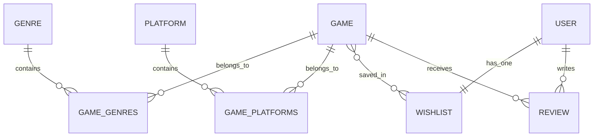

# GamePortal - Premium Django Game Catalog Web Application

GamePortal is a highly polished, dark-themed, glassmorphic gaming portal and catalog built with Django. It provides gamers with a beautifully designed hub to browse, search, and filter popular games, watch trailer videos without browser glitches, write ratings and reviews, and manage a custom watchlist. It also includes an in-app administrator control panel, a built-in JSON REST API, and an AJAX-powered dynamic interface.

---

## 🚀 Key Features & Advanced Integrations

This project implements the following advanced capabilities as detailed in the grading scheme:

1. **Authentication & Authorization (Login/Signup/Logout)**:
   - Full user authentication using Django's built-in auth system.
   - Customized glassmorphic sign-up, sign-in, and sign-out interfaces with field errors validation.
   - Staff-only authorization restricts access to the **Admin Dashboard** and controls game deletions/review deletions.
2. **Search & Multi-Criteria Filtering**:
   - Live title/developer/publisher/description keyword searching.
   - Interactive genre selection pills that update results on-click.
   - Platform filter dropdown options.
   - Dynamic Metacritic minimum rating slider.
   - Dynamic sorting preferences (En Yeniler, En Yüksek Puanlı, Alfabetik).
3. **Django Native Pagination**:
   - The Browse catalog is paginated at exactly **6 games per page** using Django's `Paginator` class.
   - Filters, search terms, and sorting preferences are preserved across pages when shifting through tabs.
4. **AJAX Watchlist Integration**:
   - Users can add or remove games from their personal watchlist asynchronously via JavaScript `fetch`.
   - The wishlist button updates visually in real-time (toggling colors and labels) without reloading the page.
   - Instantly triggers a sliding, glassmorphic **toast notification** that alerts the user and fades out automatically.
5. **JSON REST API**:
   - Built-in lightweight REST API endpoints (accessible without external libraries):
     - `GET /api/games/` - Returns a list of all games with title, developer, Metacritic score, cover, and genres in JSON format.
     - `GET /api/games/<id>/` - Returns detailed game specifications, ratings, and its complete review log.
6. **Smart Video Handling & Custom Middleware**:
   - **Localhost Redirect Middleware**: Intercepts IP-based requests (`127.0.0.1`) and redirects them to the hostname (`localhost`). This circumvents YouTube’s strict raw-IP origin embedding restrictions.
   - **Background Audio Eraser**: Dynamic tab switching reloads the iframe target source upon navigating away from the "Fragman" tab, preventing video audio from leaking into description or reviews tabs.

---

## 🛠️ Tech Stack & Architecture

- **Backend**: Python 3.x, Django 6.x (MVC/MVT pattern)
- **Database**: SQLite (Highly normalized relations, indexes on slugs, constraints on rating scales)
- **Frontend**: Vanilla HTML5 (semantic layout), Vanilla CSS3 (Custom properties, HSL theme colors, glassmorphism filters, animations), Vanilla JavaScript (fetch requests, tab states, sliders)
- **Icons & Typography**: FontAwesome 6, Google Fonts (Outfit, Inter)

---

## 📊 Database Design & Relationships

The database schema consists of 5 related models:



### Model Specifications
- **Genre**: Represents game types (slugified matching).
- **Platform**: Targets runtime environment (PC, PlayStation 5, Xbox Series X, Nintendo Switch).
- **Game**: Core record. Sanitizes incoming YouTube watch URLs automatically inside `.save()` to privacy-enhanced `youtube-nocookie.com/embed/` format.
- **Review**: Relates `User` and `Game` with text comments and a rating score constrained to `1-10`.
- **Wishlist**: Maps one-to-one with a `User`, keeping a many-to-many relationship with `Game`.

---

## ⚙️ Setup & Installation Instructions

Follow these steps to run the project locally on Windows:

1. **Clone or Navigate to the Directory**:
   ```powershell
   cd C:\Users\mertg\.gemini\antigravity\scratch\game_portal_django
   ```

2. **Activate the Virtual Environment**:
   ```powershell
   .\venv\Scripts\activate
   ```

3. **Install Dependencies**:
   *(Django is pre-installed in the venv. If setting up from scratch, run `pip install django`)*.

4. **Apply Migrations**:
   ```powershell
   python manage.py migrate
   ```

5. **Seed the Database**:
   Populate 14 games, genres, platforms, superuser accounts, and starter reviews:
   ```powershell
   python manage.py seed_games
   ```
   - **Default Admin Account**:
     - **Kullanıcı Adı**: `admin`
     - **Şifre**: `admin`

6. **Start the Development Server**:
   ```powershell
   python manage.py runserver
   ```

7. **Access the Web Application**:
   Navigate to **`http://localhost:8000/`** in your browser. (The middleware will automatically redirect you here if you type `127.0.0.1:8000`).

---

## 🧪 Running the Test Suite

We have written **10 comprehensive tests** in `games/tests.py` covering models, template views, pagination offsets, AJAX, permissions, and REST JSON endpoints.

To run the automated tests:
```powershell
python manage.py test
```

Expected result:
```text
Creating test database for alias 'default'...
..........
----------------------------------------------------------------------
Ran 10 tests in 14.419s

OK
Destroying test database for alias 'default'...
```

---

## 📖 API Documentation

### 1. Game List API
- **Endpoint**: `/api/games/`
- **Method**: `GET`
- **Response**: List of JSON objects representing all games.
- **Example Output**:
  ```json
  [
    {
      "id": 1,
      "title": "Elden Ring",
      "slug": "elden-ring",
      "description": "...",
      "release_date": "2022-02-25",
      "rating_metacritic": 96,
      "cover_image": "...",
      "backdrop_image": "...",
      "developer": "FromSoftware",
      "publisher": "Bandai Namco",
      "video_url": "https://www.youtube-nocookie.com/embed/E3Huy2cdIh0",
      "store_url": "...",
      "is_featured": true,
      "genres": ["Aksiyon", "Macera", "RYG (RPG)"],
      "platforms": ["PC", "PlayStation 5", "Xbox Series X"]
    }
  ]
  ```

### 2. Game Detail API
- **Endpoint**: `/api/games/<id>/`
- **Method**: `GET`
- **Response**: Detailed game object along with user ratings average and comment logs.
- **Example Output**:
  ```json
  {
    "id": 1,
    "title": "Elden Ring",
    "slug": "elden-ring",
    "description": "...",
    "release_date": "2022-02-25",
    "rating_metacritic": 96,
    "cover_image": "...",
    "backdrop_image": "...",
    "developer": "FromSoftware",
    "publisher": "Bandai Namco",
    "video_url": "https://www.youtube-nocookie.com/embed/E3Huy2cdIh0",
    "store_url": "...",
    "is_featured": true,
    "genres": ["Aksiyon", "Macera", "RYG (RPG)"],
    "platforms": ["PC", "PlayStation 5", "Xbox Series X"],
    "user_rating_average": 9.5,
    "reviews": [
      {
        "id": 1,
        "user": "admin",
        "text": "Tam bir başyapıt!",
        "rating": 10,
        "created_at": "2026-06-03 20:30"
      }
    ]
  }
  ```
